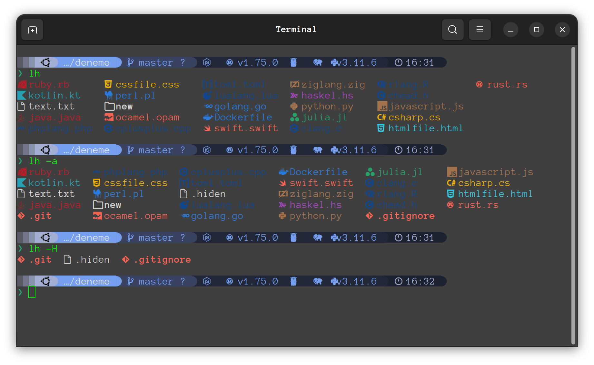
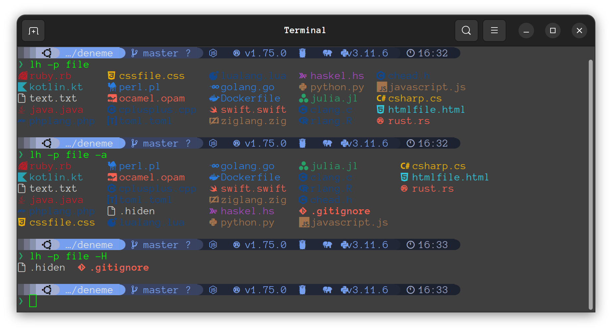
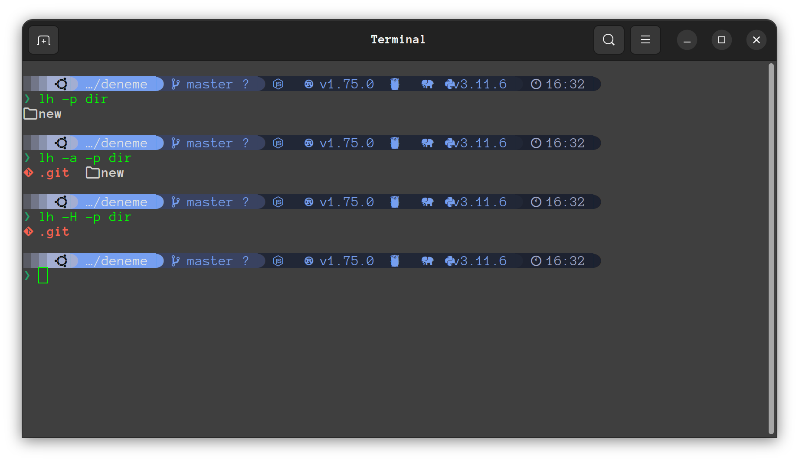

# lh
List handsomely is a customizable directory listing tool. Currently, it prints file names, but future updates will include metadata filters and more advanced features.

## Installation
### Prerequisites
Ensure you have [Nerd Fonts](https://www.nerdfonts.com/) installed and enabled for the symbols.

### Install lh
| Package Manager | Command |
|-----------------|---------|
| cargo           | cargo install lh |

## Documentation
Documentation is available [here](https://docs.rs/lh/).

## Flags
- If no filter is applied, the output includes all file types and excludes hidden files. The default input is `./`.
- `--all` or `-a` flag: Prints all files, including hidden ones.
- `--long` or `-l` flag: Provides detailed information about the files.
- `--hidden` flag: Prints only hidden files.
- `--p-type file` flag: Prints only files.
- `--p-type dir` flag: Prints only directories.
- `--filter` or `-f` flag: Prints filtered output.

## Future Plans
- [x] Customizable in Linux.
- [x] Customizable in Windows.
- [x] Bold, italic, and regular options for config.
- [ ] Implement search functionality.
- [ ] Customizable output formats.
- [ ] Advanced filtering and sorting options.
- [ ] Recursive directory listing.
